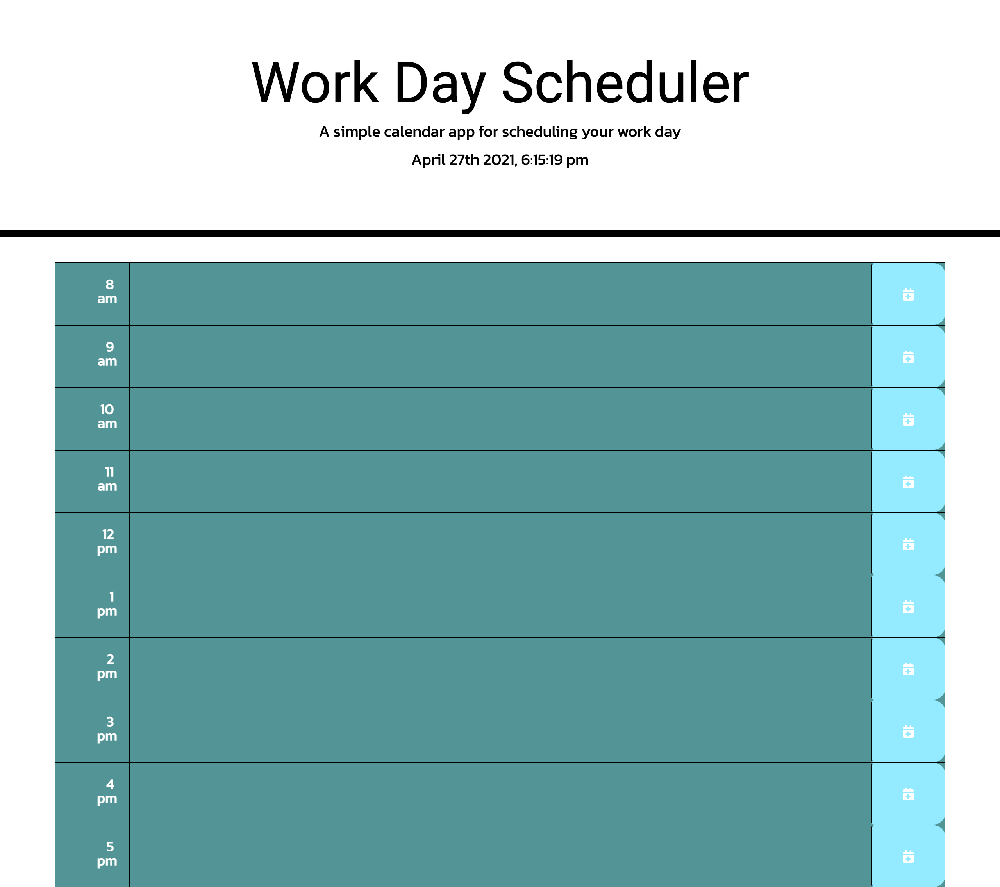

# Homework-05-Work-Day-Scheduler

## Overview

---

This project was made to build a day planner where the user is able to enter their tasks for a single work day. The planner is color coded to show the user in which time-block they are currently in. Will also color code the future time-blocks and the past time-blocks. The planner was made using JQuery, Javascript, Bootstrap, CSS and HTML.

## Instructions

---

- User would enter tasks items into the description area.
- Then press the button on the right side to save the task into the planner

